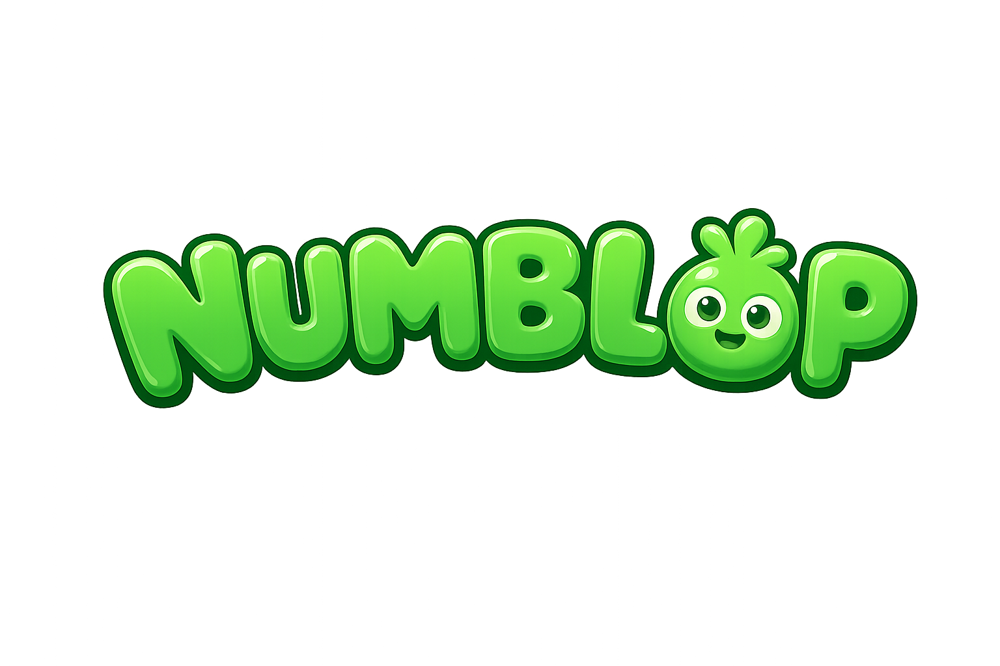

# Numblop

<p align="center">
  
</p>

Numblop is a friendly, offline multiplication-practice game for children, built with Godot 4.6.2 and
GDScript. It is portrait-first on Android, runs in a centered portrait window on Windows, and has an
adaptive Web build that fits a phone while using a wider canvas on desktop. The whole interface ships
in ten languages.

The Android package ID is permanently fixed as `cz.gutcloud.numblop`.
Public version `0.4.2`, Play version code `14`.

## Project status

The complete game loop is playable and covered by 274 automated tests plus bilingual responsive
screenshot captures. Progression, cosmetics, achievements, and the guided tutorial are all
implemented and persisted.

The first internal Play build (`0.4.0`, code `12`) is uploaded and Play App Signing is enrolled. The
release keystore, signed-AAB workflow, and verification path are established. Before the next
networking build reaches a Play track, GitHub Pages must serve the updated privacy policy, the
physical-device checklist must pass, and the Play Console data-safety and Families declarations must
be brought into line with Play Games Services. See `D18` and M5 in
[`docs/ROADMAP.md`](docs/ROADMAP.md).

## What is playable

- Opening screen with a ten-language flag picker; the choice is remembered for later launches.
- Portrait home screen with an interactive Numblop that reacts to being stroked, plus one shared bar
  showing coins, XP, level, and the current correct-answer streak.
- A one-time guided finger tutorial that walks a new child through the whole loop — play, answer,
  chest, shop, map — and resumes at the step it was interrupted on.
- Adaptive practice rounds of 10 or 12 questions using four choices, six choices, or an in-game
  numeric keypad.
- Calm answer feedback with no visible countdown. A wrong answer shows the full correct equation and
  a domino-style dot picture of the fact, then waits for a tap with no time limit.
- A guaranteed reward chest after every completed round, with an itemised breakdown: round reward,
  mastery-milestone bonuses, achievement rewards, and the total.
- A winding map of the `2×`–`9×` tables with continuous island progress, unlock celebrations, and a
  tappable ten-fact detail per island.
- Permanent next-island unlocking once at least 9 of the 10 facts in the current table reach mastery
  80. The remaining weak fact keeps coming back for review.
- Four-band mastery presentation — red while building, purple while practicing, orange when
  mastered, green when automated.
- A Trophies screen: the best-ever streak, timestamped personal streak records, and achievement
  cards with progress and coin rewards.
- A local cosmetics shop across six categories — shader-recoloured body and belly, plus hats,
  glasses, necklaces, and shoes. Purchases and equipped items persist.
- Background music, interaction and reward sounds, separate music/SFX volumes, global mute, a
  haptics toggle, and a confirmed in-game exit.
- Drag-anywhere touch scrolling on every scrolling screen.

## Learning model

Numblop tracks all 80 ordered facts from the `2×` through `9×` tables independently. Round length and
mix depend on how far the child has come:

| Current table | Questions | Current table | Older weak | Older automated |
|---|---:|---:|---:|---:|
| `2×` – `5×` | 10 | 7 | 2 | 1 |
| `6×` – `9×` | 12 | 8 | 3 | 1 |

Eligible facts are used before any repetition, and selection is deterministic for a given seed.
Mastery runs on a 0–100 scale and decides how a question is asked:

| Mastery | Interaction |
|---:|---|
| 0–59 | Choose from 4 answers |
| 60–89 | Choose from 6 answers |
| 90–100 | Enter the answer on the in-game keypad |

Correct answers add `+5` when fast or `+3` when slower; incorrect answers subtract `−2`. Mastery is
saved after every submitted answer. Table unlocks never roll back, even if an older fact later drops
below 80.

A fact counts as *automated for review purposes* only at mastery 100 — deliberately not the same
threshold as the 90 that switches a question to typed input. The single automated slot always takes
the fact that has waited longest. The complete contract is
[`docs/didactic_algorithm.md`](docs/didactic_algorithm.md).

## Progress, rewards, and saves

- Each correct answer in a completed round grants 1 coin and 1 XP; a completed round always grants at
  least 1 of each. Level is `1 + floor(XP / 100)`.
- A correct answer that pushes a fact upward across the 60, 80, or 90 band grants a separate 5-coin
  milestone bonus.
- Achievements pay coins once each: first round (100), streak tiers 10/20/50/100/500/1000, XP tiers
  500/1000/5000/10000, one per completed cosmetic collection, and one per fully mastered island.
- Everything lives in one local profile at `user://profile.json`, plus device preferences in
  `user://settings.cfg`. Saves are written atomically with a recoverable backup, and loading is
  field-tolerant with an explicit migration step, so older saves keep working and an interrupted
  write cannot cost a child their progress.

The full persistence contract, including every field and when each write happens, is
[`docs/SAVE_SYSTEM.md`](docs/SAVE_SYSTEM.md).

## Offline and local by design

Numblop is fully playable offline, signed out, and with no account — that is the product promise and
it does not expire. There are no analytics, no advertising, no in-app purchases, and no remote
configuration. All coins are earned by playing.

A Google Play Games Services integration — sign-in, cloud saves, and XP/best-streak leaderboards —
is approved and under way; the plan is [`docs/GOOGLE_PLAY_GAMES.md`](docs/GOOGLE_PLAY_GAMES.md).
Save version 10, the cloud-save merge, Android sign-in, and the normal snapshot load/merge/upload
path are implemented. Cloud save is on by default, and Google — with Family Link for supervised
children — owns the account decision. The vendored plugin exposes conflicting snapshots but no API
to resolve their conflict id, so Numblop preserves and merges those candidates locally and blocks
upload for that launch instead of risking an overwrite. All Play code remains confined to one
autoload, and a failed or refused sign-in costs a player nothing.

## Languages

English, Czech, Slovak, German, Spanish, Finnish, French, Norwegian Bokmål, Polish, and Swedish.

`localization/strings.csv` is the single source catalog and every key must be filled in every
language — a blank cell fails the test suite. Adding a language is one row in
`scripts/app/LanguageCatalog.gd` and one column in the CSV; no scene edits.
See [`docs/LOCALIZATION.md`](docs/LOCALIZATION.md).

## Requirements

- Godot `4.6.2` with export templates.
- PowerShell on Windows.
- Android SDK/JDK and an authorized device for Android export and device checks.
- Godot threadless Web export templates; the repository helper can install them when missing.

Verify the local toolchain with:

```powershell
powershell -ExecutionPolicy Bypass -File tools/check-environment.ps1
```

## Run

From the repository root:

```powershell
C:\Users\eMich\source\Godot\Godot_v4.6.2-stable_win64.exe --path .
```

The logical viewport is `390×844`; the Windows development window defaults to a centered `450×900`
portrait view. Web uses an adaptive canvas: a phone fits its available viewport, while `900×900` is
the wide desktop QA reference.

## Test and visual QA

Import the project headlessly and run the complete deterministic, persistence, localization, UI, and
smoke suite:

```powershell
powershell -ExecutionPolicy Bypass -File tools/run-tests.ps1
```

Generate and validate responsive screenshots — 27 screen states × English/Czech × three viewport
sizes:

```powershell
powershell -ExecutionPolicy Bypass -File tools/capture-responsive.ps1
```

Scene and layout changes additionally need a headless boot, because the tests instantiate scenes but
never run a real layout pass:

```powershell
& "C:\Users\eMich\source\Godot\Godot_v4.6.2-stable_win64_console.exe" --headless --path . --quit-after 120
```

With an unlocked Android phone connected and USB debugging authorized, export, install, launch, and
collect filtered logs with:

```powershell
powershell -ExecutionPolicy Bypass -File tools/android-smoke.ps1
```

## Export

```powershell
powershell -ExecutionPolicy Bypass -File tools/export.ps1 -Target windows
powershell -ExecutionPolicy Bypass -File tools/export.ps1 -Target android-debug
powershell -ExecutionPolicy Bypass -File tools/export.ps1 -Target web
```

If the Web templates are missing, run `tools/install-web-templates.ps1`. Validate the generated HTML,
JavaScript, WebAssembly, and pack files with `tools/web-smoke.ps1 -SkipExport`, or serve the build
locally by double-clicking `tools/start-web.cmd`. Do not open `build/web/index.html` directly:
WebAssembly and the game pack must be fetched over HTTP, and a `file://` launch will fail. These
commands produce ignored development artifacts in `build/`. Android release signing values must come
from environment variables or an encrypted password file outside the repository, and must never be
stored here. See [`docs/RELEASES.md`](docs/RELEASES.md) for the signed AAB workflow and release
checklist.

## Repository map

```text
scenes/                 Screens and reusable Godot scenes
scripts/core/           Pure deterministic learning rules, session generation, achievement catalog
scripts/app/            Application services and persisted models, without scene ownership
scripts/autoload/       Local saves, settings, events, and runtime coordination
scripts/ui/             UI presentation and input handling
localization/           Ten-language source catalog
assets/                 Character, background, VFX, and cosmetics artwork
ui/                     Theme, fonts, crests, branding, icons, and UI shaders
audio/                  Music, SFX, and provenance notes
tests/                  Core, state, UI, and smoke tests
tools/                  Repeatable test, capture, device, and export commands
store/                  Play listing texts, screenshots, and graphics
docs/                   Product, learning, architecture, persistence, and release contracts
```

The learning core never accesses scenes, autoloads, files, clocks, locale, or platform APIs. Scenes
present application state but never calculate mastery, session quotas, rewards, or unlocking.

## Documentation

Start with [`AGENTS.md`](AGENTS.md) for repository rules and the source-of-truth hierarchy.

| Document | Covers |
|---|---|
| [`docs/GAME_DESIGN.md`](docs/GAME_DESIGN.md) | Product scope, screens, and the player experience |
| [`docs/didactic_algorithm.md`](docs/didactic_algorithm.md) | Canonical learning rules and mastery algorithm |
| [`docs/ARCHITECTURE.md`](docs/ARCHITECTURE.md) | Technical boundaries, modules, and data flow |
| [`docs/SAVE_SYSTEM.md`](docs/SAVE_SYSTEM.md) | Save files, every persisted field, versioning, failure behaviour |
| [`docs/LOCALIZATION.md`](docs/LOCALIZATION.md) | Ten-language text contract |
| [`docs/ROADMAP.md`](docs/ROADMAP.md) | Milestone status and acceptance gates |
| [`docs/RELEASES.md`](docs/RELEASES.md) | Windows, Android, and Web delivery |
| [`docs/DECISIONS.md`](docs/DECISIONS.md) | Accepted implementation decisions, newest first |
| [`docs/GOOGLE_PLAY_GAMES.md`](docs/GOOGLE_PLAY_GAMES.md) | Play Games integration, cloud-save status, and remaining device work |
| [`docs/PLAY_CONSOLE_COMPLIANCE.md`](docs/PLAY_CONSOLE_COMPLIANCE.md) | Data safety, Families, target-audience, and content-rating worksheet |
| [`docs/TASKS.md`](docs/TASKS.md) | Historical task ledger and remaining open work |

## Bundled assets

Baloo 2 (with the Noto Sans fallback) is bundled under the SIL Open Font License. Audio supplied for
the project includes assets from Pixabay; provenance and the applicable Pixabay Content License notes
are recorded in [`audio/README.md`](audio/README.md). The repository itself is licensed under the
proprietary terms in [`LICENSE`](LICENSE) (all rights reserved; source readable, not reusable).
